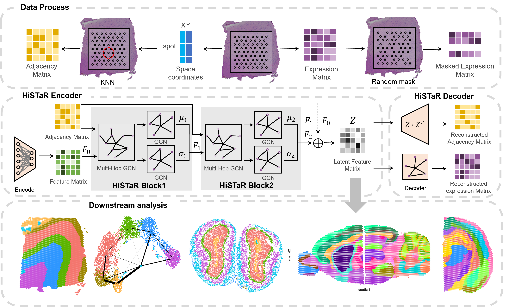

Welcome to HiSTaR Tutorials
=========================

HiSTaR: identifying spatial domains with Hierarchical Spatial Transcriptomics variational autoencoder
================================================================================================================================

.. toctree::
   :maxdepth: 1

   notebooks/Installation
   notebooks/1_DLPFC_Clustering
   notebooks/2_HBC_Clustering
   notebooks/3_MouseBrain_Clustering
   notebooks/4_Slide_seqV2_Clustering
   notebooks/5_Stereo_seq_Clustering
   notebooks/6_STARmap_Clustering
   notebooks/7_mouse_breast_CA_Batch_effects
   notebooks/8_mouse_brain_Batch_effects
   notebooks/9_mouse_brain_anterior_posterior

Overview
========
in this study, we propose a Hierarchical ST variational autoencoder (HiSTaR) to extract multi-level latent features of spots. HiSTaR tends to perform well in identifying spatial domains across multiple datasets from diverse platforms, consistently showing superior results compared to existing methods.